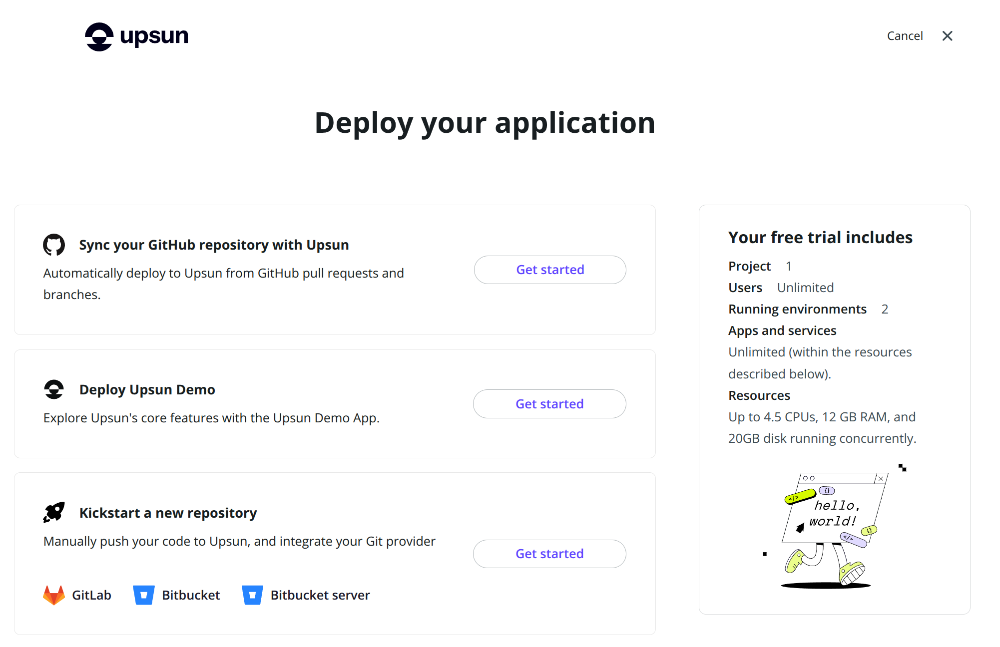
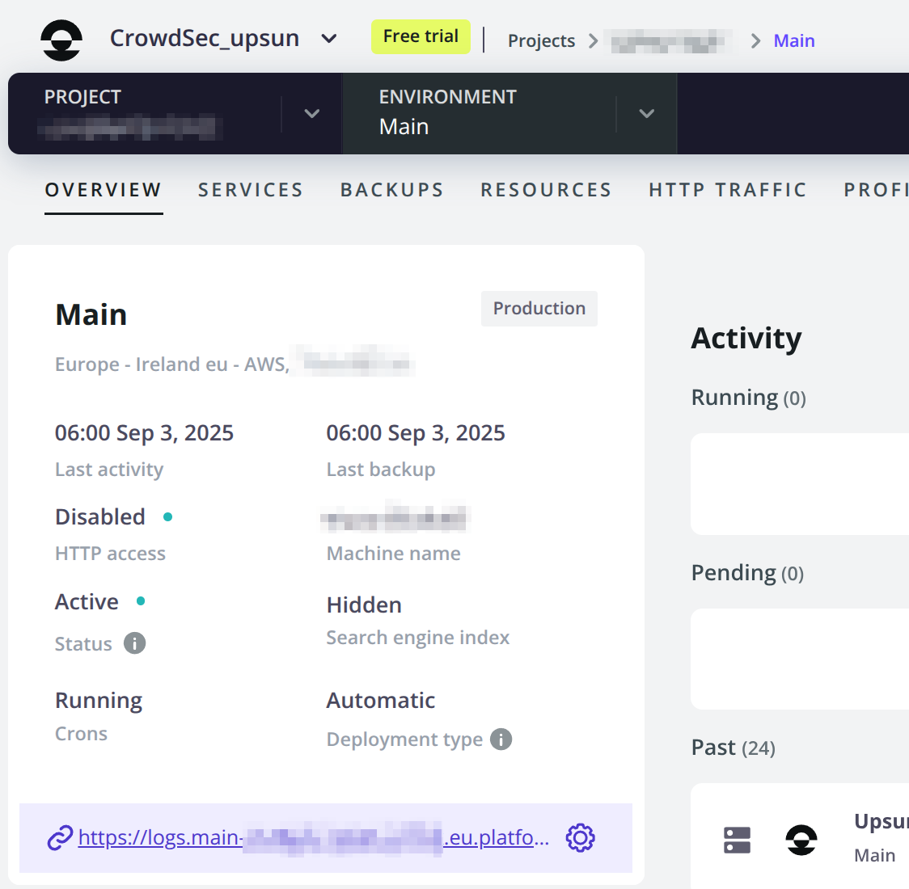
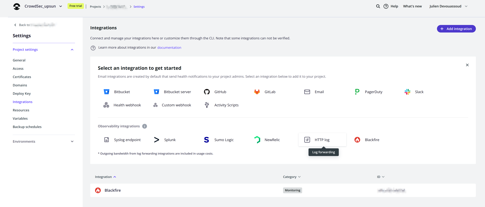
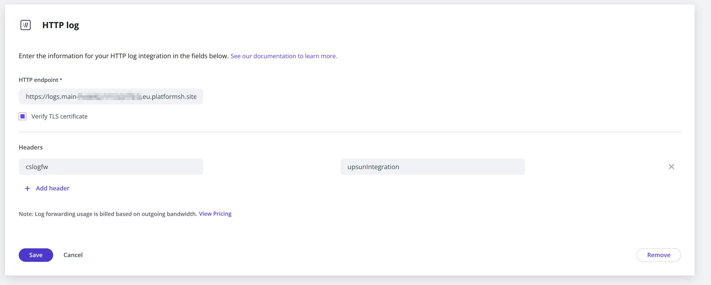
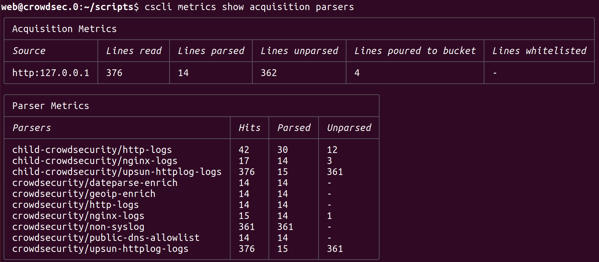
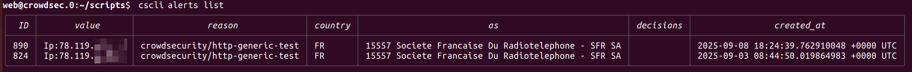

# CrowdSec Security Engine for Upsun

## Why install CrowdSec in UpSun

CrowdSec will provides real-time detection of malicious behavior that reaches your linked projects, automatically analyzing HTTP logs for attack patterns and suspicious activities. You benefit from community-curated blocklists and threat intelligence from the global CrowdSec network, ensuring proactive protection against emerging threats before they impact your applications.

> #### Disclaimer
>
>This is a beta version of the Upsun x CrowdSec integration  
> The current HTTP log forwarding approach may have limitations with high-volume traffic  
> The Upsun and CrowdSec teams are actively studying more integrated interaction methods for future releases.

## What This Project Does

This is a **standalone security service project** that you deploy on Upsun to protect **all your other Upsun projects** without modifying their code.

### Zero-Code Security Integration

1. **Deploy this project** - Fork/copy this repository and deploy it as a separate Upsun project
2. **Connect your existing projects** - Simply configure HTTP log forwarding from your existing Upsun projects to this security engine via the Upsun console using the url of the project and the following header cslogfw:upsunIntegration
3. **Get automatic protection** - CrowdSec analyzes logs in real-time and raises alerts about detected malicious activity. I can also automatically remediate (block/captcha) malicious IPs via your Cloudflare/Fastly
4. **Curated proactive protection** - On top of what you have detected in your ingress, you'll benefit from a curated list of IPs currently attacking CrowdSec network.

**Key Benefits:**
- ✅ **No code changes** to your existing projects
- ✅ **Centralized security** for multiple applications  
- ✅ **Real-time threat detection** from HTTP logs
- ✅ **Automatic blocking** at CDN level (Cloudflare/Fastly)
- ✅ **Community threat intelligence** from CrowdSec network

### How It Works

```
Your Upsun Projects → HTTP Logs → CrowdSec Upsun project → Ban Decisions → CDN Blocking
    (unchanged)       (forward)     (CrowdSec analysis)     (automatic)    (Cloudflare/Fastly)
```

This is an off-the-shelf Upsun project to deploy a CrowdSec Security Engine and optional Remediation Components (bouncers) with minimal configuration from the user.

## Quick Setup Guide

We'll start by the setting up the detection with CrowdSec starter project (Steps 1 and 2).  
In a second time we'll explain how to setup and test the remediation components for Cloudflare and Fastly.

### Prerequisites
We recommend that you fork the [repository](https://github.com/crowdsecurity/crowdsec-upsun-starter-project). This will allow you to make changes if you want to alter the default configuration of this project. 

### Step 1: Deploy the Security Engine

#### A. Create a new project based on the repository.  

You can follow [Upsun's documentation](https://docs.upsun.com/get-started/here/create-project.html)

> Reommanded "Kickstart a new repository" that will lead you to link existing code to the upsun project being created, in our case your fork of **crowdsec-upsun-starter-project**
> Don't forget to link the repository to your Upsun Project with upsun `upsun project:set-remote <your project id>`



#### B. Deploy the project 

Using the `upsun push` command or via the *upsun console*.  
It will take a few minutes to setup CrowdSec.  

In order to have **Read**&**Write** access on the app's hierarchy everything is running inside the `/app/cs/` directory:
- Deployment log will be in `/app/cs/var/log/deploy/log`
- CrowdSec root directory will be `/app/cs/etc/crowdsec/`
- ...
  
> ##### Default deployed version
> As the project builds and deploy the **v1.7.0 release** of CrowdSec  
> You can change this by creating an envirnoment variable in your upsun console `env:CROWDSEC_VERSION`  
> Or changing by the default value for `CROWDSEC_VERSION` in the `.environment` file

> ##### Setup Lockfile
> If the deployment was successful and CrowdSec process started in *user-mode*, a lock file will be created to avoid running the installation again on next deployment of the app.
> You can for a re-install by setting the env variable `REINSTALL_SUFFIX` to a string of your choice (the date for example yyyymmdd)
> the lockfile can be found there:
> `/app/cs/tmp/LAST_INSTALLED_${CROWDSEC_VERSION}${REINSTALL_SUFFIX}.lock`

#### C. Test CrowdSec in Command line

At this point CrowdSec should be running. It's not yet connected to your other projects, but we'll make sure it's setup properly.

To test that CrowdSec is running, connect via **SSH** to the project.  

Now we'll use the CrowdSec command line tool `cscli`.  
To simplify our upcoming commands let's create an alias:  
`alias cscli="/app/cs/etc/crowdsec/cscli --config /app/cs/etc/crowdsec/config.yaml"`

1. Do a basic version check with `cscli version`.
   - You should see the details of the install version
   - Make sure it's the one you wanted to install according to `CROWDSEC_VERSION`
2. Let's check the installed collections with `cscli collections list`
    - You should see a few collections linked to **upsun** **nginx** and **http**
    - You can dig further with `cscli scenarios list`
    - More collections can be installed, check https://app.crowdsec.net/hub/collections
3. check the service is running systemctl --user status crowdsec.service`

<!-- TODO add a cron for hub upgrade -->

#### D. Enroll your into CrowdSec Console (recommended)

Enrolling your CrowdSec instance into **CrowdSec Console** gives you alerting dashboards, quality of life batch actions and automations as well as access to additional blocklists

1. Create an account on [CrowdSec Console](https://app.crowdsec.net/)
2. Go to the [Security Engines section](https://app.crowdsec.net/security-engines)
3. Click on `Enroll Command` and copy the cscli command **without the `sudo` prefix**
   - ie: `cscli console enroll -e context claa0a000030wmaard5llhf`
   - Run this command in ssh.
   - On success restart CrowdSec `systemctl --user restart crowdsec.service`
4. Go back to the [Security Engines section](https://app.crowdsec.net/security-engines)
    - Refresh... After a few seconds you should see a confirmation message
    - Accept the enroll
    - You should see a tile with your newly enrolled Security Engine
    - More info on our [enroll guide page](https://doc.crowdsec.net/u/getting_started/post_installation/console/)

### Step 2: Connect Your Existing Projects

#### A. Get your CrowdSec project URL

After deployment, note the URL of the deployed project from the Overview of your main project's environment.

If you haven't set a custom domain it should look like
```
https://logs.<your-project-domain>.site
```


#### B. Send selected projects' logs to the CrowdSec project
In each of your existing Upsun projects you want to monitor, configure HTTP log forwarding:

**Via Upsun Console:**
1. Go to your project settings
2. Navigate to `Setting > Project settings >  Integrations`
3. Select and Configure and **HTTP Log integration**
    - Put the CrowdSec project url as HTTPP endpoint
    - Check verify TLS
    - Add the header `cslogfw` = `upsunintegration` *(cf acquis.d/http.yaml file)*




#### C. Verify log forwarding success

We'll check if logs are being sent to CrowdSec by looking at the log acquisition metrics using `cscli` 

The command: `cscli metrics` will list various activity metrics of CrowdSec. We'll focus on the **Acquisition Metrics** and **Parsers Metrics**.  
You can select only those two via `cscli metrics show acquisition parsers`

1. Run the cscli metrics
2. Navigate on your project via a browser
3. Check the cscli metrics again
    - You should see increasingly more lines read
    - Also lines parsed
    - And the parsers involved should be:
      - upsun-httplog-logs
      - nginx-logs
      - *..and more*



#### D. Test Detection

Let's run a generic test with a dummy alert scenario.  

Browse one of the connected projects adding the following path `crowdsec-test-NtktlJHV4TfBSK3wvlhiOBnl` 
ie: https://<yourProjectURL>/crowdsec-test-NtktlJHV4TfBSK3wvlhiOBnl

Now let's check the resulting alerts with the following command: `cscli alerts list`

You should see lines representing the various attempts.  

Note that This scenario only triggers **once per 5 minutes** for a given IP.  
Here is an example of 2 test alerts done a few days apart:  


> ##### Warning - local IPs are whitelisted
> If you're browsing from an IP local to the project it will be whitelisted and not trigger an alert  

### Step 3: Setup Remediation

The remediation components *(aka Bouncers)* maintain the list of active decisions (ban and/or captcha) in the target service they are designed to interact with. The following will explain how to setup either the Fastly or Cloudflare remediation component.

#### General notions

Remediation components work by:
1. **Polling** the CrowdSec Local API (lapi) for active decisions (bans/captcha)
2. **Synchronizing** these decisions with your CDN/service provider
3. **Automatically blocking** or challenging malicious IPs at the edge

Activation of either bouncer in this starter project rely on setting up a secret environment variable containing the token(s) allowing an interactions with the cloudflare/fastly services.

By default both remediation components will be configured to only send decisions taken by the security engine and the ones you created manually with `cscli alerts add`. You can change this restriction by modifying the `only_include_decisions_from` parameter in the remediation component configuration located at `/app/cs/etc/crowdsec/bouncers/`. An empty array mean it will use all decisions.


#### A. Cloudflare Bouncer Setup

The Cloudflare bouncer deploys a Worker script to your Cloudflare zones and automatically manages IP blocking decisions based on the list of decisions kept in a Key/Value store and updated periodically by the remediation component.

1. Generate a token with the appropriate rights linked to the zones you want to protect:
    - [Click this link to create token](https://dash.cloudflare.com/profile/api-tokens?permissionGroupKeys=%5B%7B%22key%22%3A%22account_settings%22%2C%22type%22%3A%22read%22%7D%2C%7B%22key%22%3A%22challenge_widgets%22%2C%22type%22%3A%22edit%22%7D%2C%7B%22key%22%3A%22user_details%22%2C%22type%22%3A%22read%22%7D%2C%7B%22key%22%3A%22workers_kv_storage%22%2C%22type%22%3A%22edit%22%7D%2C%7B%22key%22%3A%22workers_routes%22%2C%22type%22%3A%22edit%22%7D%2C%7B%22key%22%3A%22workers_scripts%22%2C%22type%22%3A%22edit%22%7D%2C%7B%22key%22%3A%22zone%22%2C%22type%22%3A%22read%22%7D%2C%20%7B%22key%22%3A%20%22dns%22%2C%20%22type%22%3A%22read%22%7D%2C%20%7B%22key%22%3A%22d1%22%2C%20%22type%22%3A%22edit%22%7D%5D&name=)
    - [Public documentation reference](https://doc.crowdsec.net/u/bouncers/cloudflare-workers/)
2. Create a secret environment variable in your upsun console named `env:CLOUDFLARE_API_TOKENS`
    - If you have generated multiple tokens for multiple zones you can have them comma separated
3. Deploy the remediation component
    - **via SSH**: run `sh /app/scripts/2_deploy-bouncer.sh`
    - **or via upsun console**: re-deploy
    - Deploy logs are located there `/app/cs/var/log/deploy.log`
4. Check the bouncer is properly connected
    - `cscli bouncers list` should show the newly registered **crowdsec-cloudflare-worker-bouncer**
5. See the worker and KV created in your cloudflare interface
6. Test the remediation with a ban of 2 minutes on your mobile IP for example:
    - `sudo cscli decisions add --ip 1.2.3.4 --duration 3m`
   ```

#### B. Fastly Bouncer Setup

The Fastly bouncer manages IP blocking via Fastly's Edge ACL feature across your configured services, automatically synchronizing banned IPs with your Fastly service configurations.

By default the Fastly bouncer will clone your active version and create its own ACLs and VCLs in it. It will not activate this clone version automatically, you'll need to activate it from the Fastly console. 

1. Generate a token with the appropriate rights linked to the services you want to protect:
    - Go to [Account → Personal API Tokens](https://manage.fastly.com/account/personal/tokens)
    - Click **Create Token** 
      - Set type `Automation token`
      - Set **Scope** to `global` (required for ACL management)
      - Chose the services it can access to.
      - Set expiration to `Never Expire` to avoid having to re generate it.
2. Create a secret environment variable in your upsun console named `env:FASTLY_API_TOKENS`
    - If you have generated multiple tokens for multiple services you can have them comma separated
3. Deploy the remediation component
    - **via SSH**: run `sh /app/scripts/2_deploy-bouncer.sh`
    - **or via upsun console**: re-deploy
    - Deploy logs are located there `/app/cs/var/log/deploy.log`
4. Check the bouncer is properly connected
    - `cscli bouncers list` should show the newly registered **crowdsec-fastly-bouncer**
    - `systemctl --user status crowdsec-fastly-bouncer` should show service as "active (running)"
5. Activate the created service configuration
    - Check that a configuration version has been created in your service(s)
    - You should see multiple ACLs containers space reserved/created for `ban` and `captcha` decisions
    - You can activate this configuration if you want to test it now
6. Test the remediation with a ban of 2 minutes on your mobile IP for example:
    - `cscli decisions add --ip 1.2.3.4 --duration 3m`
    - After a few seconds you should see that IP appear in the first free ACLs (max 1000 items per ACL)
